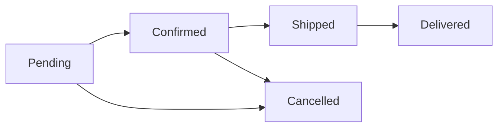

<div align="center">

# 🛍️ Modern E-Commerce Platform

A production-ready E-commerce system powered by a robust **FastAPI backend** and elegant **Flutter frontends**.

[](https://python.org)
[](https://fastapi.tiangolo.com)
[](https://flutter.dev)
[](https://supabase.com)
[](https://opensource.org/licenses/MIT)

</div>

---

## ✨ Features

- **Blazing Fast API**: Built with FastAPI for optimal performance and asynchronous processing.
- **Cross-Platform Apps**: Includes both a Customer Mobile App and a dedicated Admin Portal built with Flutter.
- **Secure Authentication**: Integrated with Supabase for robust and secure user management.
- **Seamless Database**: Fully functional relational database design ready for scale.
- **Interactive UI/UX**: Crafted carefully to deliver a premium shopping and management experience.

---

## 🛠️ Prerequisites

Before you begin, ensure you have met the following requirements:
- **Python 3.10+**
- **Node.js** (for Flutter web support if applicable)
- **Git**
- **Supabase Account** (for database & authentication)

---

## 🚀 Quick Start Guide

### 1. Clone the Repository

```bash
git clone https://github.com/sandeepbangaru17/ecommerce.git
cd ecommerce
```

### 2. Backend Setup

Set up your Python virtual environment and install dependencies:

```bash
cd backend

# Create and activate virtual environment
python -m venv venv

# Windows:
venv\Scripts\activate
# Linux/Mac:
source venv/bin/activate

# Install required packages
pip install -r requirements.txt
```

### 3. Database & Supabase Integration

1. Navigate to [Supabase](https://supabase.com) and create a new project.
2. Open the **SQL Editor** in your Supabase dashboard.
3. Execute the schema script located at `backend/supabase_schema.sql`.

### 4. Environment Configuration

Duplicate the example environment file and configure it:

```bash
copy .env.example .env
```

Update `.env` with your Supabase credentials (found under **Settings → API**):

```env
SUPABASE_URL=https://your-project.supabase.co
SUPABASE_KEY=your-anon-key
SUPABASE_SERVICE_KEY=your-service-role-key
JWT_SECRET=your-secret-key
```

### 5. Launch the Backend API

```bash
cd backend
uvicorn app.main:app --reload --port 8000
```
> **🌍 API is live at:** `http://localhost:8000`

---

## 🧪 Testing the API

### Automated Testing (CLI)
Run our comprehensive CLI test suite:
```bash
cd backend
python cli_test_client.py
```

### Manual Testing with cURL
```bash
# Verify API Health
curl http://localhost:8000/health

# Fetch All Products
curl http://localhost:8000/products

# Register a New User
curl -X POST http://localhost:8000/auth/signup \
  -H "Content-Type: application/json" \
  -d '{"email":"test@test.com","password":"password123"}'
```

---

## 📱 Running the Flutter Applications

Install Flutter from [flutter.dev](https://flutter.dev/docs/get-started/install) and add it to your PATH.

### Customer Mobile Application
```bash
cd frontend/customer_app
flutter pub get
flutter run
```

### Admin Portal
```bash
cd frontend/admin_portal
flutter pub get
flutter run
```

---

## 🏗️ Project Architecture

```graphql
ecommerce/
├── backend/
│   ├── app/
│   │   ├── api/          # 🌐 FastAPI route definitions
│   │   ├── core/         # ⚙️ Application configs & settings
│   │   ├── schemas/      # 📄 Pydantic validation models
│   │   └── services/     # 🧠 Core business logic
│   ├── cli_test_client.py
│   ├── requirements.txt
│   └── supabase_schema.sql
├── frontend/
│   ├── customer_app/     # 👗 Flutter mobile application
│   └── admin_portal/     # 📊 Flutter dashboard for admins
└── README.md             # 📖 You are here
```

---

## 📡 API Reference

A brief overview of the exposed endpoints. Discover the full interactive documentation at `http://localhost:8000/docs` after starting the server.

| Endpoint | Method | Auth Required | Description |
| :--- | :---: | :---: | :--- |
| `/health` | `GET` | ❌ | Subsystem health validation |
| `/products` | `GET` | ❌ | Retrieve a list of all products |
| `/products/{id}` | `GET` | ❌ | Fetch specific product details |
| `/auth/signup` | `POST` | ❌ | Register a new customer |
| `/auth/login` | `POST` | ❌ | Authenticate and obtain JWT |
| `/orders` | `POST` | 🔒 | Place a new customer order |
| `/orders` | `GET` | 🔒 | Retrieve user order history |
| `/orders/{id}` | `GET` | 🔒 | Get specifics of a single order |
| `/orders/{id}/status`| `PUT` | 🛡️ (Admin) | Update an order's state |

---

## 🔄 Order Lifecycle


*(Orders usually flow from Pending → Confirmed → Shipped → Delivered. Cancellations can occur before shipping)*

---

## 🚨 Troubleshooting

<details>
<summary><b>Flutter: command not found</b></summary>
Ensure Flutter is properly downloaded, extracted, and its `bin` directory is successfully added to your system's `PATH` variable. Check out the <a href="https://flutter.dev/docs/get-started/install">official guide</a> for more details.
</details>

<details>
<summary><b>Python Module not found</b></summary>
Make sure your virtual environment is actively running before installing requirements or starting the server:
<br><br>
<b>Windows:</b> <code>venv\Scripts\activate</code><br>
<b>Unix:</b> <code>source venv/bin/activate</code>
</details>

<details>
<summary><b>Supabase Connection Errors</b></summary>
Double-check your <code>.env</code> file. Missing variables or incorrect URL/Key pairs are the typical culprits. Ensure you have copied strings exactly as they appear in your Supabase dashboard settings.
</details>

---

<div align="center">
  <p>Released under the <b>MIT License</b>.</p>
</div>
